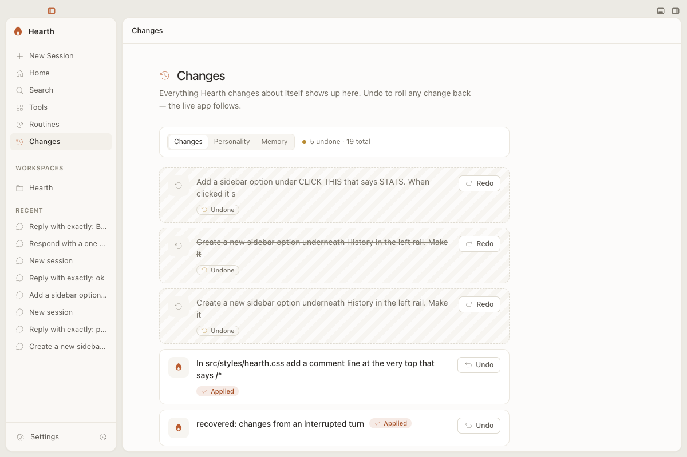
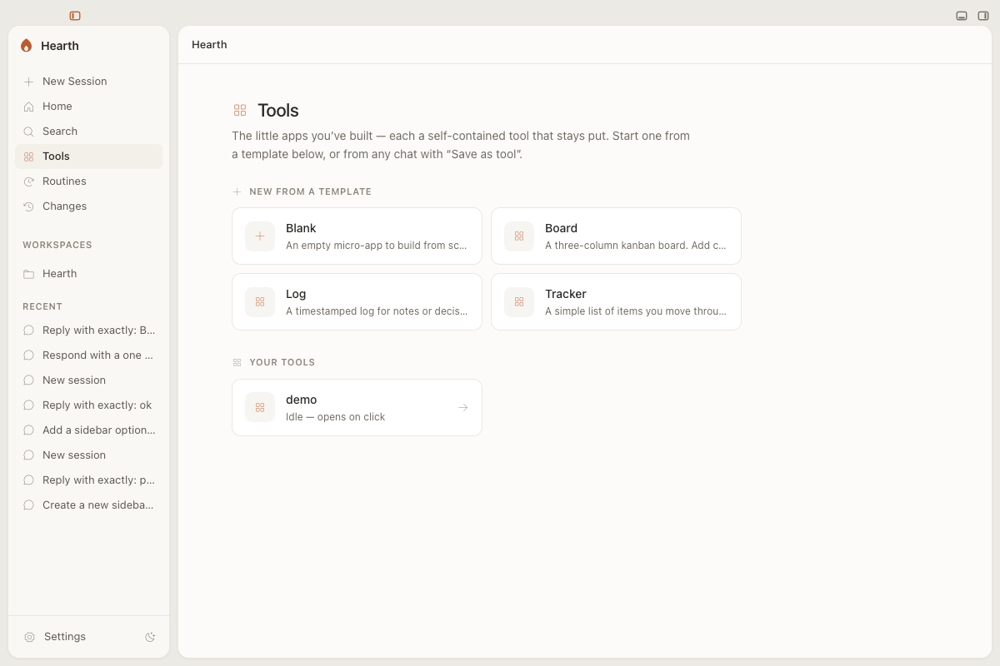
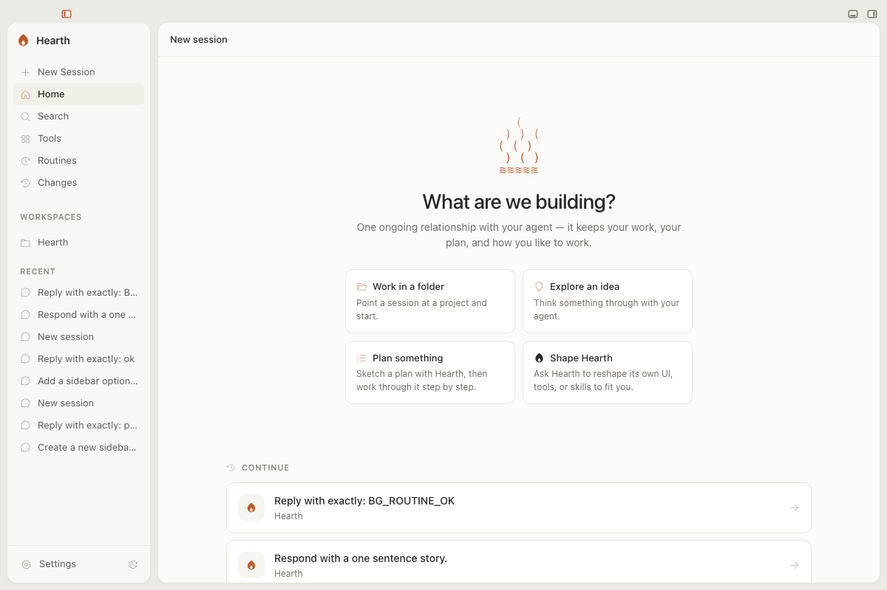
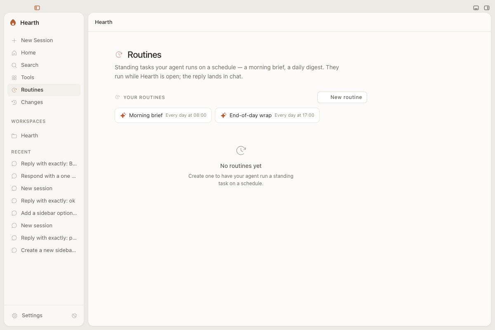

# Hearth

**A desktop home for your coding agent.** Hearth turns Claude Code or Codex into a
workspace that does visible work, remembers your projects, and reshapes itself to
fit how you work.


[](LICENSE)


### [⬇ Download for macOS (Apple Silicon)](https://pub-aacb176d4db84288936664754f7f6c5b.r2.dev/Hearth-0.1.0-arm64.dmg)

Signed and notarized by Apple. Open the `.dmg`, drag Hearth to Applications, and
launch it like any other app.

<p align="center">
  
</p>

---

## The idea

You already have a coding agent. It lives in a terminal, answers a question, and
forgets. Hearth gives that same agent a place to actually build and a memory that
sticks around.

Ask for something and you get a result you can see and keep: a chat that streams
real work, a small tool, a dashboard, a plan you can step through. The work stays
attached to the conversation that made it, in a workspace that's yours across
every session.

And the app itself is editable. Tell Hearth to move a button, restyle a view, or
add a panel, and it edits its own running interface and reloads it in front of
you. Every change is versioned, so anything it does, you can undo.

## Who it's for

Hearth is for people who already use **Claude Code or Codex** and want more than a
prompt box: developers, builders, and technical knowledge workers who'd rather
hand their agent a folder and get back finished work than copy snippets out of a
chat window.

You bring the agent. Hearth drives your own login over the open
[Agent Client Protocol](https://agentclientprotocol.com), so the intelligence is
the model you already trust from the terminal. If you've never run a coding agent
before, this isn't your starting point.

## What you can do

- **Talk and get work, not just words.** Type a request; Hearth runs it on your
  local agent and streams the reply, with file edits, diffs, and approvals inline.

- **Reshape the app by asking.** "Add a Stats item to the sidebar." "Make this
  panel roomier." Hearth edits its own source and hot-reloads the change live. The
  **Changes** view lists every self-edit with one-click undo.

- **Build little apps that stay put.** Turn any chat into a reusable tool with
  **Save as tool**, or start from a Board, Log, or Tracker template. Each tool is
  its own self-contained app in your **Tools** gallery.

- **Put work on a schedule.** **Routines** are standing tasks your agent runs for
  you, like a morning brief or an end-of-day wrap, with the reply waiting in chat.

- **Switch between code and knowledge.** Point a session at a project for the
  developer workbench (files, terminal, git, review), or work in knowledge mode
  with sources and documents. Hearth picks the right one and you can flip it.

- **Find anything later.** Full-text search across every session by title,
  workspace, or what was actually said.

## Yours, and private by default

- **Your agent, your login.** Hearth uses your existing `claude login` /
  `codex login` (or your own API key). It never stores, brokers, or sees your
  credentials.
- **Your machine.** Files and conversations stay local. Hearth hosts nothing.
- **Updates that don't interrupt.** New versions download in the background;
  Hearth tells you when one's ready and waits for you to restart.

## Requirements

- A Mac with **Apple Silicon** (M1 or later).
- A **Claude Code or Codex** login (subscription or API key). Hearth is the
  workspace; you supply the agent.
- An internet connection on first launch (Hearth downloads its workspace once,
  then runs locally).

## A look inside

<table>
  <tr>
    <td width="50%">
      
      <sub><b>Changes</b> · every edit the app makes to itself, versioned and one-click reversible</sub>
    </td>
    <td width="50%">
      
      <sub><b>Tools</b> · turn any chat into a reusable mini-app that stays put</sub>
    </td>
  </tr>
  <tr>
    <td width="50%">
      
      <sub><b>Home</b> · start a session, or pick up where you left off</sub>
    </td>
    <td width="50%">
      
      <sub><b>Routines</b> · standing tasks your agent runs on a schedule</sub>
    </td>
  </tr>
</table>

---

## Build from source

Hearth is a self-evolving app: the renderer is served by a live Vite server, so an
agent editing its source changes the running UI, and every edit is a git commit
you can revert. The full design is in
[docs/ARCHITECTURE.md](docs/ARCHITECTURE.md); packaging + auto-update in
[docs/AUTO-UPDATE.md](docs/AUTO-UPDATE.md) and
[docs/PACKAGING-V3-PLAN.md](docs/PACKAGING-V3-PLAN.md).

Requires [Bun](https://bun.sh) and a locally-authenticated agent.

```bash
bun install
bun dev                        # opens the app with live HMR (Claude backend)
HEARTH_AGENT=codex bun dev     # same app, Codex backend
bun test                       # ACP translation, git, self-mod, classifier, adapters
bun run typecheck && bun run lint
bun run dist                   # signed macOS build (set APPLE_* to also notarize)
```

Useful flags: `HEARTH_FAKE_AGENT=1` runs a scripted agent (no model, no auth) for
UI work; `HEARTH_PERMISSION_MODE=default` prompts on every edit instead of
auto-accepting.

## License

[Apache-2.0](LICENSE).
