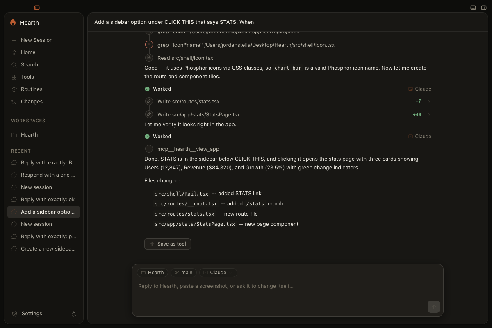

# Hearth

Hearth is a macOS desktop client for coding agents (Claude Code or Codex) that can
edit its own running interface. The renderer is served by a live Vite dev server,
so when the agent edits Hearth's own source the change hot-reloads into the window
with no restart, and every edit is a git commit you can revert. The agent can also
see and drive the app the way you would, through a small MCP server it is given.

The one example that captures it: say "add a Stats item to the sidebar," and the
agent edits the app's own source, the sidebar reshapes in front of you, and the
change shows up in the Changes view with one-click undo.


[](LICENSE)

<p align="center">
  
</p>

## Status

Personal project, v0.1.0. macOS on Apple Silicon (M1 or later) only. Roughly 23k
lines with 475 passing tests. It works and it is tested, but it is not a
product and comes with no support. Use it at your own risk.

You bring your own agent. Hearth drives the Claude Code or Codex you already
authenticated with `claude login` / `codex login` (or your own API key) over the
open [Agent Client Protocol](https://agentclientprotocol.com). It never stores,
brokers, or sees your credentials, and it hosts nothing: files and conversations
stay on your machine.

## Install

### [Download for macOS (Apple Silicon)](https://github.com/skeletor-js/Hearth/releases/latest)

Open the `.dmg`, drag Hearth to Applications, and launch it. The current build is
signed but not yet notarized, so Gatekeeper will warn on first launch: right-click
the app and choose Open. A notarized build is coming; building from source (below)
avoids the warning entirely. Either way you need a locally-authenticated Claude
Code or Codex before it will do anything useful.

## Build from source

Requires [Bun](https://bun.sh) and a locally-authenticated agent.

```bash
bun install
bun run routes:gen              # generate the TanStack route tree (needed before typecheck from a fresh clone)
bun run dev                     # opens the app with live HMR (Claude backend)
```

Same app on the Codex backend:

```bash
HEARTH_AGENT=codex bun run dev
```

Checks and a packaged build:

```bash
bun test                        # ACP translation, git, self-mod, scope guard, boot watchdog, classifier
bun run typecheck
bun run lint
bun run dist                    # signed macOS build (set APPLE_* env vars to also notarize)
```

Useful flags for UI work: `HEARTH_FAKE_AGENT=1` runs a scripted agent with no
model and no auth; `HEARTH_PERMISSION_MODE=default` prompts on every edit instead
of auto-accepting.

## The self-mod safety model, in brief

Hearth lets the agent edit almost anything in the repo, including the main process.
Safety comes from recoverability, not from fencing the agent out.

- **Scope guard.** Every write is classified into one of three tiers. *Blocked*
  paths are never writable (secrets, credential and shell-init files, system
  directories, git internals). The *protected island* (the self-mod engine, the
  boot watchdog, the hook config) is editable only with explicit approval and is
  written dependency-free so the agent cannot disarm a guardrail indirectly.
  Everything else is the *canvas*. Writes route through Hearth's own file
  capability, and shell writes that try to bypass the guard are forced back onto
  the mediated path.
- **Boot watchdog.** A main-process edit that bricks startup is caught by a marker
  armed before each self-mod restart and cleared only on a healthy boot. If the
  next boot still finds the marker, the edit never came up, so the watchdog
  auto-reverts that commit and relaunches, with a bounded attempt count to avoid a
  revert loop.
- **Atomic parallel edits.** A single agent's edit hot-swaps immediately. When two
  or more subagents write concurrently, a snapshot-overlay Vite plugin pins their
  pre-edit baselines and swaps the batch in atomically, so the live UI never shows
  a half-applied state.
- **Versioned undo.** Every self-edit is a `Hearth-SelfMod` git commit, grouped by
  turn into file-disjoint commits, and reversible from the Changes view.

## Architecture

The full design and rationale is in [docs/ARCHITECTURE.md](docs/ARCHITECTURE.md).
Domain vocabulary is in [CONCEPTS.md](CONCEPTS.md). The self-evolution engine lives
in `electron/main/self-mod/`; `scope-guard.ts` and `boot-watchdog.ts` are the two
files worth reading first. Packaging and auto-update are covered in
[docs/AUTO-UPDATE.md](docs/AUTO-UPDATE.md) and
[docs/PACKAGING-V3-PLAN.md](docs/PACKAGING-V3-PLAN.md).

## License

[Apache-2.0](LICENSE).
