# refactor: Hearth audit remediation

Implementation plan for the findings of the 2026-06-09 technical audit of Hearth.
Executed by a goal loop (`ce-work`-style) in a separate session, one unit per
iteration, in dependency order. **Analysis is done; this plan is decisions, not
discovery.** Every cited line was verified against `b953f98`.

## Summary

The audit graded Hearth **B**: strong type hygiene, real-behavior tests, accurate
docs, and a security-aware architecture — undercut by a handful of its own
documented guarantees not actually being enforced, no CI, no field observability,
and an end-of-life Electron. This plan closes those gaps in four phases: a safety
net (CI + characterization tests) before any refactor, then critical
security/correctness fixes, then high-leverage structural and performance work,
then polish.

**Scope confirmed with the owner:** multi-window is hypothetical (fix the doc, do
not build broadcast state); the Files tab must *not* let user or agent edit
protected-island paths (hard deny); audience is the owner alone (file logging, not
crash-reporting SaaS); routines run **headless**, which promotes two UX items to
prerequisites; `design/handoff/` is still consulted (relocate, do not delete).

**Out of scope:** building the documented main-canonical broadcast state model;
list virtualization (deferred unless a real slow session appears); a renderer
component/DOM test suite; type-aware eslint; `asar`/bundle-size reduction. See
[Scope Boundaries](#scope-boundaries).

---

## Problem Frame

The audit produced concrete, line-cited findings across security, correctness,
performance, testing, dependencies, and ops. Five themes explain most of them:

1. **Documented guarantees aren't enforced** — the protected self-mod island is
   writable via a side door (`fsWrite`), "every channel is validated" has no
   runtime validation, the documented state model was never built, the committed
   route tree references a deleted route and the typecheck gate is blind to it,
   and nothing enforces the green checks because there is no CI.
2. **The agent process and its failures aren't first-class** — adapter crash →
   silence; errors carry no sessionId; no logs; no crash handlers.
3. **The hot path has no budget** — per streamed token: full-transcript markdown
   re-parse, forced scroll layout, sessionStorage serialize, index.json rewrite.
4. **Critical logic lives in unowned glue** — the turn lifecycle (in an IPC
   callback) and the transcript reducer (in a `setMsgs` updater) are the two most
   intricate state machines and the two least tested.
5. **Aging foundation** — Electron 33 (9 majors behind), dep drift, denylist
   payload, an undeclared `tar` dependency in the release path.

Because Hearth edits its own source, its docs are the agent's operating
instructions: an unenforced guarantee is worse than none, because the agent will
faithfully build on whichever version is false.

---

## Requirements Traceability

Each unit cites the audit finding it closes (security S#, architecture F#,
renderer R-F#, plus testing/devex/deps items). The owner's answers to the audit's
open questions are binding constraints, carried into U4, U7, U14, U16, U17.

---

## Key Technical Decisions

- **KTD-1 — Safety net precedes refactor.** CI (U1) and turn-lifecycle
  characterization tests (U3) land before the extractions (U12, U13) they protect.
  Principle: never refactor untested safety-critical glue.
- **KTD-2 — `fsWrite` hard-denies island/blocked tiers, no escape hatch** (owner
  decision: users may not hand-edit protected files). The check lives server-side
  in the IPC handler because `eval_js`-driven writes are indistinguishable from
  user writes at that layer.
- **KTD-3 — Headless routines reclassify two "UX" fixes as prerequisites.** U6
  (replay/live race) and U7 (background permission policy) are correctness issues
  for unattended turns, not polish — they move into the critical phase.
- **KTD-4 — Observability is file-only.** Rotating log in `userData/Logs` + uncaught
  handlers; no Sentry/crashReporter, no privacy-policy work. For an audience of one,
  a readable log is the whole requirement and the diagnostic surface for U5's
  unattended failures.
- **KTD-5 — Fix the State doc, don't build broadcast.** Multi-window is
  hypothetical; rewrite ARCHITECTURE.md's State section to the real presence/nonce
  design (U16). Re-evaluate only if multi-window becomes real.
- **KTD-6 — Electron upgrade steps majors in pairs on a branch**, gated by a manual
  dist smoke build, and pauses for owner sign-off before merge. It is the one task
  whose risk the owner's answers do not soften (the embedded browser + downloaded
  payload are in the daily loop).
- **KTD-7 — U-IDs are execution order; the `(was T#)` tag preserves continuity**
  with the audit's task table and the prior loop prompt.

---

## High-Level Technical Design

Dependency graph across the four phases. An edge means "must be DONE first." Units
with no inbound edge are independently startable within their phase.

```mermaid
graph TD
  subgraph P0["Phase 0 — Safety net"]
    U1[U1 CI]
    U2[U2 routeTree gate]
    U3[U3 turn-lifecycle char tests]
  end
  subgraph P1["Phase 1 — Critical fixes"]
    U4[U4 fsWrite hard-deny]
    U5[U5 agent-exit recovery]
    U6[U6 replay/live race]
    U7[U7 bg permission policy]
    U8[U8 bridge Host check]
    U9[U9 release integrity]
    U10[U10 Electron upgrade]
  end
  subgraph P2["Phase 2 — High-leverage"]
    U11[U11 memoize chat render]
    U12[U12 transcript reducer extract]
    U13[U13 TurnCoordinator extract]
    U14[U14 file logging]
    U15[U15 micro-app stop-on-unmount]
    U16[U16 ARCHITECTURE State doc fix]
  end
  subgraph P3["Phase 3 — Polish"]
    U17[U17 relocate design/handoff]
    U18[U18 throttle per-delta writes]
    U19[U19 eslint react-hooks]
    U20[U20 fix 3 error silencers]
    U21[U21 useWorkspaces hook]
    U22[U22 IPC input validation]
    U23[U23 publish ordering + cleanup]
  end
  U1 --> U2
  U1 --> U9
  U3 --> U5
  U3 --> U13
  U5 --> U6
  U5 --> U13
  U11 --> U12
  U12 --> U6
  U12 --> U18
```

`ce-work` derives progress from git; this plan stores none. The loop picks the
lowest-numbered unit whose dependencies are all merged.

---

## Phase 0 — Safety net

### U1. CI workflow (was T1)

**Goal:** Enforce the already-green checks on every push and PR, including the
agent's own self-mod PRs.
**Requirements:** DevEx finding "no CI."
**Dependencies:** none.
**Files:** `.github/workflows/ci.yml` (new).
**Approach:** One job on `push`/`pull_request`: `bun install --ignore-scripts`
(skips the `electron-rebuild -f -w node-pty` postinstall — no test imports
node-pty, verified) → `bun run typecheck` → `bun run lint` → `bun test`. macOS
runner (dugite/native expectations); pin Bun. A signed `dist` build needs Apple
secrets and stays a separate manual-trigger workflow, not this gate.
**Patterns to follow:** scripts in `package.json:8-21`.
**Test scenarios:**
- Pipeline green on a clean checkout of `main`.
- Temporarily break one test → job goes red → revert the break. (Proves the gate
  bites; do not commit the break.)
- `--ignore-scripts` install still lets typecheck/lint/test run.
**Verification:** A PR shows the CI check; a failing check blocks a red X.

### U2. Route-tree freshness gate + regenerate (was T2)

**Goal:** Fix the stale committed route tree and make the self-mod typecheck gate
no longer blind to route breakage.
**Requirements:** Renderer finding R-F10 (`routeTree.gen.ts:19` imports the
deleted `./routes/ask-superbud`; `@ts-nocheck` at line 3 hides it from `tsc`).
**Dependencies:** U1.
**Files:** `src/routeTree.gen.ts` (regenerate), `electron/main/self-mod/validate.ts`,
`.github/workflows/ci.yml` (extend).
**Approach:** Regenerate the tree via the TanStack plugin (dev/build start does it)
and commit it. Add a freshness check that fails when the committed tree imports a
route file that does not exist on disk — run it in CI and wire it into the
post-edit validation path (`validate.ts`, currently `execFile` typecheck only). A
filesystem existence check over the tree's route imports is sufficient; do not try
to typecheck the `@ts-nocheck` file.
**Patterns to follow:** `validate.ts:19-31` subprocess+timeout shape.
**Test scenarios:**
- Committed tree matches `src/routes/` contents → gate passes.
- Delete a route file without regenerating → gate fails with the missing path.
- An agent edit that adds a route then regenerates → gate passes.
**Verification:** `bun run typecheck` clean AND the new gate fails on a deleted
route; CI runs it.

### U3. Turn-lifecycle characterization tests (was T3)

**Goal:** Pin the current `agentPrompt` ordering invariants *before* U13 extracts
them, so the refactor is provably behavior-preserving.
**Requirements:** Architecture finding F3 (`ipc.ts:157-242` is an 85-line god
handler with zero tests owning the self-mod turn lifecycle).
**Dependencies:** none (lands before U5/U13 touch the path).
**Files:** `electron/main/ipc.turn-lifecycle.test.ts` (new) or a sibling test
beside an extracted seam; may require a thin testable seam without yet doing the
full U13 extraction.
**Approach:** Drive the handler against a stub agent and assert the ordering:
recover-interrupted → snapshot dirty baseline → beginTurn/mint run → suppress
overlay reload → prompt → endRun in a `finally` → captureTurn → turnEnd. Assert
`endRun` runs even when the prompt rejects, and that JSON-RPC error normalization
(`ipc.ts:194-206`) still produces a clean message. Use the existing `StubAgent`
pattern.
**Execution note:** Characterization-first — capture current behavior exactly,
including any quirks; do not "fix" anything here.
**Patterns to follow:** `electron/main/agents/agent-host.test.ts` stub usage;
`self-mod-service.test.ts` for `captureTurn`.
**Test scenarios:**
- Happy turn: assert full ordered sequence fires once.
- Prompt rejects mid-turn → `endRun` still fires (finally), `captureTurn` still
  commits the partial edit.
- Interrupted prior turn → recovery runs before the new baseline snapshot.
- Reordering any two steps (mutate locally) fails a test. (Proves the pin.)
**Verification:** Tests green against current code; a deliberate reorder turns them
red.

---

## Phase 1 — Critical fixes

### U4. `fsWrite` hard-denies protected/blocked tiers (was T4)

**Goal:** Close the side door that lets the Files tab — or an agent via
`eval_js` → `window.hearth.files.write` — write into the protected self-mod island,
voiding the "agent can never disarm its own guardrails" guarantee.
**Requirements:** Security finding S#3 (`fs/files.ts:60-64` does only `safeJoin`
containment, no `classifyWrite`; reachable via `ipc.ts:401-403`). Owner decision:
hard deny, no user escape hatch.
**Dependencies:** none.
**Files:** `electron/main/ipc.ts` (the `fsWrite` handler near `:401`),
`electron/main/self-mod/scope-guard.ts` (reuse `classifyWrite`/tier logic),
`electron/main/self-mod/scope-guard.test.ts` (extend) or a new
`ipc.fswrite-guard.test.ts`.
**Approach:** In the `fsWrite` handler, when `cwd` resolves to the Hearth repo
root, classify the target path and reject `blocked` and `protected` tiers with a
typed error the Files tab surfaces ("protected path — not editable"). Canvas
writes are unaffected. Keep the check in the IPC layer (server side), not the UI —
`eval_js` writes bypass the UI. Other workspaces (non-Hearth) keep plain
`safeJoin` behavior.
**Patterns to follow:** `scope-guard.ts:5-9` tier definitions; the workspace-root
detection already used for self-session gating.
**Test scenarios:**
- `files.write('electron/main/self-mod/boot-watchdog.ts', …)` on the Hearth repo →
  rejected.
- `files.write('.claude/settings.json', …)` → rejected.
- `files.write('src/app/chat/ChatView.tsx', …)` (canvas) → allowed.
- Same protected path under a *different* registered workspace → allowed (guard is
  Hearth-repo-scoped).
- Reject surfaces a typed error code the renderer can show.
**Verification:** New scope-guard test asserts island writes via the IPC path are
rejected; existing canvas-write behavior unchanged; suite green.

### U5. Agent-subprocess crash recovery + attributed errors (was T5)

**Goal:** Make adapter death a first-class event: tear down host state, settle
pending permissions, and surface an error attributed to the *correct* session.
**Requirements:** Architecture F1 (`acp-client.ts:102-108` only nulls connection +
logs; `agent-host.ts:93-106` keeps the dead agent cached; sessions hold closures
over the dead connection), F5 (raw `'agent:error'` string at `index.ts:301`
bypasses `HEARTH_CHANNELS`), F6/R-F9 (error has no sessionId →
`presence-bridge.ts:30` misattributes to the active session).
**Dependencies:** U3 (its tests guard the `captureTurn`-in-finally invariant this
touches).
**Files:** `electron/main/agents/acp-client.ts`, `electron/main/agents/agent-host.ts`,
`electron/main/ipc.ts`, `electron/main/index.ts:301`, `electron/shared/protocol.ts`
(extend `agent:error` payload), `electron/preload/index.ts` (type),
`src/app/presence-bridge.ts:30`, `src/app/presence-store.ts`,
`src/app/chat/ChatView.tsx:295-298`, plus tests in
`electron/main/agents/agent-host.test.ts` and `acp-translate`/client tests.
**Approach:** Add an `onExit` callback to `AcpClient` (constructor option — do NOT
import the host, preserve dependency direction). The existing `child.on('exit')`
handler invokes it. `AgentHost` registers it: evict the cached agent + per-kind
sessions, reject in-flight prompt promises with a typed `AgentDiedError`, and
settle outstanding `pendingPermissions` (`ipc.ts:125-148`) for the dead agent's
sessions (also fixes the resolver leak, R-F7). Broadcast `agent:error` as
`{ sessionKey, message }` via `HEARTH_CHANNELS.agentError`. The host already maps
ACP ids → renderer keys (`agent-host.test.ts:77-91`). Verify `captureTurn` still
fires on a mid-turn death so a half-applied self-mod turn is committed/recovered,
not orphaned (the main gotcha; U3 catches regressions).
**Patterns to follow:** `agent-host.test.ts:73-104` backend-switch teardown.
**Test scenarios:**
- StubAgent whose child "dies" mid-stream → host evicts cache, presence clears,
  `agent:error` carries the dying session's key.
- Background session dies while a *different* session is foreground → error lands on
  the background session, not the foreground one.
- Pending permission on a dying session → resolver settles (no leak, agent promise
  doesn't hang).
- Next prompt after death triggers a fresh connect (not the cached dead agent).
- Mid-turn death → `captureTurn` still commits the partial edit.
**Verification:** Killing the adapter mid-turn (manual: `kill -9` the child)
surfaces an attributed error, presence unsticks, and the next prompt reconnects.

### U6. Replay/live ordering + stick-to-bottom (was T13)

**Goal:** Fix transcript corruption when switching to a session whose turn is
streaming — the normal way a headless routine's output is encountered.
**Requirements:** Renderer R-F8 (`ChatView.tsx:308-335` clears then async-replays
while `:275-294` applies live updates immediately → history appends after live
content) and R-F3 (`:337-339` scrolls to bottom unconditionally, blocking
scrollback during a stream). KTD-3: headless routines make this a prerequisite.
**Dependencies:** U5 (shares the session-attribution work), U12 (cleaner once the
reducer is extracted).
**Files:** `src/app/chat/ChatView.tsx`.
**Approach:** Per-session epoch: when switching sessions, buffer live updates that
arrive during replay and apply them after the transcript loads (load-then-subscribe
per epoch, or queue-and-flush). Stick-to-bottom only when the user is already at the
bottom (measure before the append; don't force-scroll on every change).
**Patterns to follow:** the serialized per-session persistence in
`transcript-persist.ts:10-17` (disk order is already correct — mirror that ordering
in memory).
**Test scenarios:**
- Switch to a mid-stream session → replayed history appears above live content in
  correct order; no duplication.
- Scrolled up during a stream → position holds; new tokens don't yank to bottom.
- Scrolled at bottom during a stream → auto-follows.
- Rapid session switches → no cross-session bleed.
**Verification:** Via the `hearth` MCP `view_app` loop: open a streaming session
from elsewhere, confirm order and scroll behavior on screen.

### U7. Background permission policy for headless turns (was BG-PERM, new)

**Goal:** Decide and implement what happens when a routine's (non-foreground) turn
hits a permission request — today the resolver sits in `pendingPermissions` waiting
for a UI that isn't showing, hanging the turn overnight.
**Requirements:** Implied by routines being headless (owner answer #7) + R-F7
(abandoned resolvers) + the turn-lock machinery anticipating background turns
(`ipc.ts:152-156`).
**Dependencies:** U5 (pending-permission settling lands there).
**Files:** `electron/main/ipc.ts` (permission handling `:125-148`),
`electron/main/agents/acp-client.ts:143-147` (permission handler),
`electron/main/routines/` (policy origin), possibly `src/shell/WaitingBanner.tsx`
(cross-session surface seam already exists), tests under `routines/`.
**Approach:** Propose first, then implement. Default recommendation: a background
(non-foreground) turn's permission ask **fails closed** — auto-respond `cancelled`
(matching the existing `acp-client.ts:143-147` cancel-on-error behavior), log the
reason (U14), and mark the routine run as needing attention rather than hanging.
Optionally surface a cross-session "N waiting" affordance via `WaitingBanner` for
the next time the app is focused. Pick fail-closed unless the owner wants the
surface; this is the U7 decision the loop must record.
**Patterns to follow:** `acp-client.ts:143-147` (cancel returns to agent), the
"never ask, drop a fire rather than storm" posture in `routines/scheduler.ts`.
**Test scenarios:**
- Permission ask on a background session → resolves `cancelled` without hanging;
  reason logged.
- Same ask on the foreground session → still prompts the user normally.
- Routine run that hit a denied permission is marked attention-needed, not "done."
**Verification:** A scripted background turn requesting a permission completes
(cancelled) instead of hanging; foreground prompting unchanged.

### U8. Agent-bridge Host/Origin allowlist (was T7)

**Goal:** Defense-in-depth against DNS rebinding on the loopback `/eval` server
that runs arbitrary JS in the live renderer.
**Requirements:** Security S#1 (`agent-bridge.ts:84-110`: bearer token is the only
gate; no Host/Origin check).
**Dependencies:** none.
**Files:** `electron/main/agent-bridge.ts`, `electron/main/agent-bridge.test.ts`.
**Approach:** Before serving any endpoint, reject unless the `Host` header is
exactly `127.0.0.1:<port>` (the bound port) and no browser-style `Origin` is
present. Keep the bearer-token check. MCP tools call with the right Host, so they
are unaffected.
**Patterns to follow:** existing token check at `agent-bridge.ts:86`.
**Test scenarios:**
- Valid token + correct `Host` → served.
- Valid token + foreign `Host` (rebinding shape) → rejected.
- Valid token + browser `Origin` present → rejected.
- Missing/wrong token → still rejected (unchanged).
**Verification:** `agent-bridge.test.ts` covers the new rejections; MCP
`view_app`/`eval_js` still work end to end.

### U9. Release-pipeline integrity (was T8)

**Goal:** Remove the two release-pipeline fragilities: an undeclared dependency and
a denylist that ships dev packages to users by default.
**Requirements:** Deps findings — `tar` used but undeclared
(`build-workspace-payload.mjs:26`), payload built by denylist-filtering the dev
machine's `node_modules` (`:48-60`).
**Dependencies:** U1 (CI proves the lockfile install stays clean).
**Files:** `scripts/build-workspace-payload.mjs`, `package.json`,
`scripts/publish-update.mjs`.
**Approach:** Declare `tar` as a devDependency. Invert the payload composition to
an allowlist of the renderer runtime deps actually needed (react, react-dom,
zustand, @tanstack/react-router, codemirror/xterm/marked/etc. as the renderer
imports), or build it from a pruned production install into a staging dir, rather
than "everything minus EXCLUDE." Document the two-channel placement rule (shell
ships vite; payload ships react) in a short `docs/` note or a package.json-adjacent
comment, since the placement looks wrong but is load-bearing.
**Patterns to follow:** `build-workspace-payload.mjs:37` (`PAYLOAD_DRY_RUN`),
`:125-126` (manifest-last ordering).
**Test scenarios:**
- `PAYLOAD_DRY_RUN=1` lists only intended packages (no `@aws-sdk`, no test-only
  tooling).
- Fresh `bun install --frozen-lockfile` then payload build succeeds (proves `tar`
  resolves from a declared dep, not hoist luck).
- Built payload still boots the renderer (manual: install + first-run).
**Verification:** Dry-run output reviewed; a clean-install payload build succeeds.

### U10. Electron upgrade 33 → current supported major (was T6)

**Goal:** Get off an end-of-life Chromium in an app that embeds a live browser and
executes a downloaded payload.
**Requirements:** Security/Deps — Electron 33.4.11 vs latest 42; only ~last 3
majors get security patches.
**Dependencies:** U1, U2 (CI + route gate catch regressions during the bump).
**Files:** `package.json` (electron, likely electron-vite 2→current, electron-builder
25→26, @electron/notarize 2→3), `bun.lock`, packaging configs under
`electron/main/packaging/`, possibly `electron/main/browser/browser-view.ts` and
morph-capture if `webContents` APIs shifted.
**Approach:** Branch-only. Step majors in pairs (e.g. 33→36→38→40→current as
electron-vite support allows), and at each step: `bun install`, `electron-rebuild`
for node-pty (likeliest breakage — prebuilt ABI availability), boot, run the suite,
and exercise the browser view + terminal + one self-mod turn. Watch: `webContents`
API removals (browser-view/morph-capture), `safeStorage` behavior (secret store),
electron-builder/notarize compat, and newer-Chromium CSP defaults vs the packaged
Vite dev server. Produce a manual signed dist smoke build before merge. **Pause for
owner sign-off before merging** (KTD-6).
**Execution note:** Highest-risk unit. Checkpoint after each major step; do not
batch the whole jump.
**Test scenarios:**
- Full `bun test` green at each major step.
- App boots; renderer HMR works.
- Embedded browser loads an https page; `browser_eval` works.
- Terminal (node-pty) spawns and renders.
- One self-mod turn edits a renderer file and hot-reloads.
- `bun run dist` produces a signed (and, with APPLE_* set, notarized) build.
**Verification:** Suite green on the bumped runtime + a working signed dist build,
reviewed with the owner before merge.

---

## Phase 2 — High-leverage

### U11. Memoize the chat render path (was T9)

**Goal:** Remove the O(history × tokens) + O(reply²) markdown re-parse that janks
streaming.
**Requirements:** Renderer R-F1 (`ChatView.tsx:444-455` re-renders the full list per
delta; `MessageView` unmemoized; `renderMd` called inline at `:553` →
marked+DOMPurify+hljs per token, including `highlightAuto` at `markdown.ts:37`).
**Dependencies:** none (but pairs naturally before U12).
**Files:** `src/app/chat/ChatView.tsx`, `src/app/chat/markdown.ts`.
**Approach:** `React.memo(MessageView)` keyed on `(message, isLast, busy)`; extract a
`TextBlock` that memoizes `renderMd(text)` per block (finished blocks have stable
identity via the reducer). Drop `highlightAuto` for unlabeled fences (or cap input
size) to kill the most expensive path. Keep DOMPurify on every agent-content sink.
**Patterns to follow:** the stable block-id minting documented at
`ChatView.tsx:109-113`.
**Test scenarios:**
- Profiler/React DevTools: earlier messages do not re-render while the last message
  streams.
- A 10k-token reply over a long transcript streams without pegging a core.
- Sanitization still applied (no regression — agent HTML still goes through
  DOMPurify).
- Code copy-click (`handleCodeCopyClick`) still works post-memo.
**Verification:** `view_app` during a long stream shows no jank; DevTools confirms
scoped re-renders.

### U12. Extract + test the transcript reducer (was T10)

**Goal:** Move the most intricate renderer state machine out of a `setMsgs` updater
into a pure, tested module.
**Requirements:** Architecture/Quality F7 (`ChatView.tsx:139-270` ~130-line reducer
inline, zero tests).
**Dependencies:** U11 (memo boundaries make the extraction cleaner).
**Files:** `src/app/chat/transcript-reducer.ts` (new),
`src/app/chat/transcript-reducer.test.ts` (new), `src/app/chat/ChatView.tsx`
(consume it).
**Approach:** Extract the `apply` logic (text/thought run coalescing, trace-step
attachment, plan dedup, end-of-turn result synthesis) as a pure
`(state, update) → state` function with ids minted by the caller (as today). Cover
it to `run-tracker.ts` quality. ChatView shrinks ~200 lines.
**Execution note:** Behavior-preserving extraction; the reducer is already
pure-by-construction.
**Patterns to follow:** `electron/main/self-mod/run-tracker.ts` (pure, dependency-
free, fully unit-tested).
**Test scenarios:**
- Open text run coalesces consecutive text deltas into one block.
- Thought run vs text run kept distinct.
- Trace step attaches to the right message.
- Duplicate plan updates deduped.
- End-of-turn synthesizes the result block once.
- Interleaved thought/text/trace produces stable, ordered blocks.
**Verification:** New test file green; ChatView visibly thinner; streaming behavior
unchanged on screen.

### U13. Extract `TurnCoordinator` from `ipc.ts` (was T11)

**Goal:** Make `ipc.ts` the thin transport the architecture doc describes by moving
the turn lifecycle into a tested `self-mod/` module.
**Requirements:** Architecture F3.
**Dependencies:** U3 (its characterization tests prove the move is safe), U5 (exit
handling intersects the lifecycle).
**Files:** `electron/main/self-mod/turn-coordinator.ts` (new),
`electron/main/self-mod/turn-coordinator.test.ts` (new), `electron/main/ipc.ts`
(handler becomes a thin call).
**Approach:** Lift the recover→baseline→beginTurn→suppress→prompt→endRun(finally)
→captureTurn→turnEnd sequence into a coordinator with injected dependencies
(agent host, self-mod service, run tracker). The `agentPrompt` handler becomes a
≤15-line transport. U3's tests now run against the coordinator directly.
**Patterns to follow:** `self-mod-service.ts` orchestration style + its existing
tests.
**Test scenarios:** (inherit and migrate U3's scenarios to the coordinator)
- Full ordered sequence on a happy turn.
- `endRun` in finally on prompt rejection; `captureTurn` still commits.
- Interrupted-turn recovery precedes baseline.
- Coordinator is unit-testable without Electron IPC.
**Verification:** U3 scenarios pass against the extracted module; `ipc.ts` handler
under ~15 lines; file under ~450 lines.

### U14. Main-process file logging + uncaught handlers (was T12)

**Goal:** Give the owner something to read when a self-modifying, auto-updating,
headless-routine-running app misbehaves in the field.
**Requirements:** DevEx — 9 `console.*` in all of `electron/main`; no log file, no
`crashReporter`, no `uncaughtException`/`unhandledRejection` handlers. KTD-4:
file-only.
**Dependencies:** none (but U5/U7 failures are diagnosed through it — land early in
Phase 2).
**Files:** `electron/main/log.ts` (new), the ~9 console call sites
(`index.ts:114,122,246`, `dev-server.ts:48`, `agents/acp-client.ts:107`, etc.),
`electron/main/index.ts` (install handlers + adapter stderr piping),
`src/app/settings/sections/SystemSections.tsx` (a "Reveal logs" affordance).
**Approach:** A small rotating file logger writing to `app.getPath('userData')/Logs`.
Route the existing console sites and adapter stderr through it; install
`process.on('uncaughtException')` and `'unhandledRejection')` to log + flush. Add a
Settings button that opens the log folder (`shell.showItemInFolder`). No remote
reporting, no PII policy work.
**Patterns to follow:** existing best-effort fs writes (`agent-bridge.ts:174-185`
mode handling); Settings section structure.
**Test scenarios:**
- Logger writes a line to the expected path; rotates past the size cap.
- An uncaught exception lands in the log (not just the void).
- "Reveal logs" opens the right folder.
- `Test expectation: light` — most value is the integration, not assertions; cover
  the rotation + path logic as a unit.
**Verification:** Triggering an error leaves a readable log; Settings reveals it.

### U15. Micro-app server stop-on-unmount (was T14)

**Goal:** Stop leaking a ~100-200 MB node+Vite process per tool ever opened.
**Requirements:** Renderer R-F5 (`stopMicroApp` exists + exposed at
`preload/index.ts:286` but no renderer caller; only `stopAllMicroApps` at quit,
`index.ts:312`). Owner left the policy to me → stop-on-unmount with grace.
**Dependencies:** none.
**Files:** `src/shell/MicroAppFrame.tsx`, `electron/main/micro-apps/server.ts`,
`src/routes/tools.tsx` / `src/routes/micro.$name.tsx`.
**Approach:** On `MicroAppFrame` unmount, start a ~30s grace timer; if the frame
hasn't remounted (quick back-nav) by expiry, call `stopMicroApp`. Reattach to the
live server if the user returns within the window. Idle-reaping infra is not
justified for a single user.
**Patterns to follow:** xterm disposal lifecycle in
`src/app/workbench/TerminalTab.tsx:65-73` (the model for clean teardown).
**Test scenarios:**
- Open then leave a tool; after grace, its Vite process is gone.
- Open → leave → return within grace → same server reused, no restart.
- Open 3 tools, leave all → 0 idle processes after grace.
- App quit still stops everything (unchanged).
**Verification:** Process check (`ps`/port scan) shows no idle micro-app servers
after the grace window.

### U16. Rewrite ARCHITECTURE.md State section (was T15)

**Goal:** Make the doc describe the state design that exists, since the doc is the
agent's instruction set.
**Requirements:** Architecture F2 (ARCHITECTURE.md:204-209 describes main-canonical
"asymmetric request-broadcast" that was never built; reality is renderer-local
zustand + nonce-refetch + optimistic Composer writes). KTD-5: fix doc, don't build.
**Dependencies:** none.
**Files:** `docs/ARCHITECTURE.md`.
**Approach:** Replace the State section with the real design: five renderer-local
zustand stores, nonce-bump-and-refetch propagation, renderer-derived presence
persisted to sessionStorage, view-in-router. Note broadcast state as a future option
*if/when* multi-window becomes real (currently hypothetical). Also soften the
"every channel is validated" claim (F4) or point it at U22.
**Test scenarios:** `Test expectation: none — documentation.`
**Verification:** Section matches `session-store.ts`, `presence-store.ts`,
`Composer.tsx:369-381`; no remaining claim contradicts the code.

---

## Phase 3 — Polish

### U17. Relocate `design/handoff/` out of the canvas (was T17)

**Goal:** Stop 2,500 lines of un-linted JSX from sitting where the agent freely
edits, while keeping it as design reference (owner: still consulted).
**Requirements:** Quality F9. Owner answer #5.
**Dependencies:** none.
**Files:** move `design/handoff/**` → `docs/design/`; update the one referrer
(`src/styles/hearth.css:3` comment); add to `eslint.config.js` ignores if still
matched.
**Approach:** `git mv` the directory under `docs/` (signals reference-not-code),
fix the CSS comment path, confirm nothing imports it (audit found zero importers).
**Test scenarios:** `Test expectation: none — file move.` Verify `bun run lint` and
`bun run typecheck` stay clean and no import breaks.
**Verification:** Suite + typecheck + lint green; files live under `docs/design/`.

### U18. Throttle per-delta writes (was T19)

**Goal:** Cut write amplification that grows with concurrent (incl. headless)
sessions.
**Requirements:** Renderer R-F4 (`presence-store.ts` `persist` serializes per
token) and R-F6 (`sessions/store.ts:95-107,202-212` full pretty-printed
`index.json` rewrite per delta; `background-persister.ts:20` for background
sessions).
**Dependencies:** U12 (cleaner once the reducer owns block state).
**Files:** `src/app/presence-store.ts`, `electron/main/sessions/store.ts`,
`src/app/background-persister.ts`.
**Approach:** Debounce the `index.json` `patch()` (the append stays per-delta for
durability — that rationale is sound, `ChatView.tsx:102-107`; only the index bump is
wasteful). Throttle or partialize the presence `persist` so hot fields don't
serialize every token.
**Test scenarios:**
- N deltas → 1 (debounced) index rewrite, not N; append count unchanged.
- Presence persists at most once per throttle window under a token storm.
- Crash mid-stream still recovers the transcript from the append log.
**Verification:** Instrument/observe fewer index writes under a stream; durability
preserved.

### U19. Add `eslint-plugin-react-hooks` + trial `noUncheckedIndexedAccess` (was T16)

**Goal:** Catch the two renderer bug classes nothing currently catches: hooks-deps
regressions and unchecked index access.
**Requirements:** Quality F8.
**Dependencies:** none.
**Files:** `eslint.config.js`, `tsconfig.json`, plus whatever fixes the rules
surface.
**Approach:** Add `eslint-plugin-react-hooks` (the codebase deliberately uses
stale-closure-safe `[]`-dep subscriptions — verify they're flagged correctly or
annotated). Trial `noUncheckedIndexedAccess`; fix the raw-index sites
(`ChatView.tsx:144`, `Composer.tsx:468`, `run-tracker.ts:213`) or consciously
reject if the churn outweighs the value. Keep type-aware lint off (justified at
`eslint.config.js:5-7`).
**Test scenarios:** `bun run lint` and `bun run typecheck` green after the rule
addition + fixes; no behavior change.
**Verification:** New rules active in CI; suite green.

### U20. Fix the three real error silencers (was T18)

**Goal:** Stop hiding signal in the three catches that actually drop it.
**Requirements:** Quality F14 — `ipc.ts:479` (failed post-logout reconnect
vanishes), `ipc.ts:374-376` (any terminal-create failure → reasonless dead
terminal), `acp-client.ts:143-147` (permission-handler failure unlogged).
**Dependencies:** U14 (log target exists).
**Files:** `electron/main/ipc.ts`, `electron/main/agents/acp-client.ts`.
**Approach:** Log each via U14's logger; for the terminal case, propagate a reason
to the renderer so the dead terminal explains itself. Leave the ~51 deliberate,
commented best-effort catches alone.
**Test scenarios:**
- Terminal create with a bad cwd → renderer shows a reason, not a blank dead pane.
- Post-logout reconnect failure → logged.
- Permission-handler throw → cause logged, still returns `cancelled`.
**Verification:** Each path logs/surfaces; deliberate catches untouched.

### U21. Shared `useWorkspaces()` hook + dedup (was T20)

**Goal:** Collapse the copy-pasted workspaces fetch-and-subscribe across 9
components and the duplicated "Already exists" toast.
**Requirements:** Quality F12, F13.
**Dependencies:** none.
**Files:** a new hook (e.g. `src/app/use-workspaces.ts`), call sites
(`Composer.tsx`, `CommandPalette.tsx`, `Onboarding.tsx`, `Rail.tsx`,
`routes/routines.tsx`, `routes/new.tsx`, `sessions.ts`), and the toast logic
shared between `ChatView.tsx:390-395` and `routes/tools.tsx`.
**Approach:** One hook owning list + live-flag subscription; replace the 9 inline
copies. Extract the micro-app "Already exists" toast into one helper. Optionally
align `routines.tsx`/`tools.tsx`/`new.tsx` with the route+app-folder seam — but keep
that scoped (don't balloon into a route refactor).
**Test scenarios:**
- Hook returns workspaces and updates on the live flag (unit test with a stubbed
  `window.hearth`).
- A rename reflects across surfaces after refetch.
- Toast helper fires identically from both call sites.
**Verification:** 9 call sites use the hook; suite + typecheck green; no behavior
change on screen.

### U22. Runtime validation for disk-bound IPC inputs (was T21)

**Goal:** Make "every channel is validated" true for the few structured inputs that
reach disk, in an app that treats a compromised renderer as in-scope.
**Requirements:** Architecture F4 (`ipc.ts:417-421`: `McpServerInput`,
`CreateRoutineInput`, `SoulConfig` trusted as-shaped).
**Dependencies:** U16 (doc claim aligned).
**Files:** `electron/main/ipc.ts`, the relevant input types in `electron/shared/`,
new tests.
**Approach:** Add narrow runtime validation (hand-rolled guards matching the
existing no-new-deps style, or a tiny validator) for the structured inputs that get
persisted — reject malformed shapes with typed errors. Don't add a validation
framework; match the codebase's dependency restraint.
**Test scenarios:**
- Malformed `CreateRoutineInput` (missing/typed-wrong fields) → rejected, nothing
  written.
- Malformed `McpServerInput` → rejected.
- Malformed `SoulConfig` → rejected.
- Well-formed inputs → unchanged behavior.
**Verification:** New tests cover rejection; existing flows unaffected.

### U23. Publish ordering + repo cleanup (was T22)

**Goal:** Remove the alphabetical-accident upload ordering and stray clutter.
**Requirements:** DevEx Low — `publish-update.mjs:76-89` uploads in `readdirSync`
order (feed-last holds by `H` < `l` luck); `.hearth` clutter (`bridge-url 2`, 9 MB
`sign-debug.log`).
**Dependencies:** none.
**Files:** `scripts/publish-update.mjs`, `.gitignore`/`.hearth` housekeeping.
**Approach:** Make artifact-then-feed ordering explicit (upload `latest-mac.yml`
last by intent, not sort order). Note: `.hearth` is gitignored, so cleanup is local
hygiene, not a commit — just stop the clutter accumulating.
**Test scenarios:**
- Dry-run/inspection shows the feed file uploaded after artifacts regardless of
  filename sort.
- `Test expectation: light` — ordering assertion only.
**Verification:** Upload order is explicit in code; reviewed.

---

## Scope Boundaries

**In scope:** U1–U23 above.

### Deferred to Follow-Up Work
- **List virtualization** — after U11, the unbounded message array is Low for
  realistic sessions. Pull in only if a real session feels slow.
- **Per-route error boundaries** — the root boundary + CrashSurface is the
  deliberate recovery design; revisit only if a route crash pattern emerges.

### Outside this effort's identity (owner-confirmed)
- **Building the main-canonical broadcast state model** — multi-window is
  hypothetical; U16 fixes the doc instead.
- **Renderer component/DOM test suite** — poor ROI for a single owner; pure-logic
  extraction (U12) + the `view_app` screenshot loop fits this codebase.
- **Type-aware eslint** — the off trade-off is justified (`eslint.config.js:5-7`).
- **`asar: false` / bundle-size reduction** — forced by the live-Vite self-mod
  design; an accepted cost.
- **Crash-reporting SaaS / privacy policy** — file logging (U14) is the whole
  requirement for this audience.

---

## Risks & Dependencies

- **U10 (Electron) is the highest-risk unit** — native ABI (node-pty), `webContents`
  API drift, notarize/builder compat. Mitigation: pairwise major steps, suite at
  each step, manual signed smoke build, owner sign-off before merge. Its risk is the
  one the owner's answers do not reduce.
- **U5/U13 touch the turn lifecycle** — gated behind U3's characterization tests;
  the `captureTurn`-in-finally invariant is the specific thing not to break.
- **U6 + U18 depend on U12** — do the reducer extraction first or these fight the
  inline `setMsgs` logic.
- **No CI until U1** — U1 is first precisely so every subsequent unit is gated.
- **Self-modifying recursion** — units editing `electron/main` restart the running
  app. The denylist (no writes to `self-mod/**`, `.claude/**`, secrets) + branch-
  per-unit keeps it recoverable; watch the first few iterations rather than walking
  away, especially U5/U10.

---

## Open Questions (execution-time)

- **U7 policy:** fail-closed (recommended) vs. a cross-session waiting surface. The
  loop should record the decision when it reaches U7; default fail-closed unless the
  owner asks for the surface.
- **U10 target major:** the exact "current supported" Electron at execution time —
  resolve live, don't hardcode 42.
- **U19 `noUncheckedIndexedAccess`:** adopt vs. reject based on the actual fix churn
  it surfaces — a judgment to make once the errors are visible.

---

## Definition of Done (whole plan)

CI red on any failed test/typecheck/lint; zero High audit findings open; adapter-
kill-mid-turn recovers visibly with an attributed error; route-tree freshness
checked in the self-mod gate; payload built from an allowlist with `tar` declared;
Electron within its support window; a readable main-process log exists. Performance
bar: streaming stays under one dropped frame (~16ms commits) on a 100-message
transcript with a 10k-token reply, and session open under 500ms at 500 messages.
